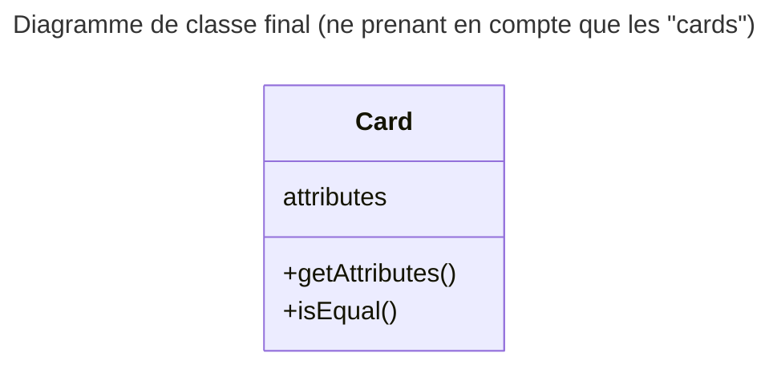

# Class diagram

```mermaid

---
title: Diagramme de classe final (ne prenant en compte que les "cards")
---

classDiagram

    
    class Card{
        attributes
        +getAttributes()
        +isEqual()
    }

```