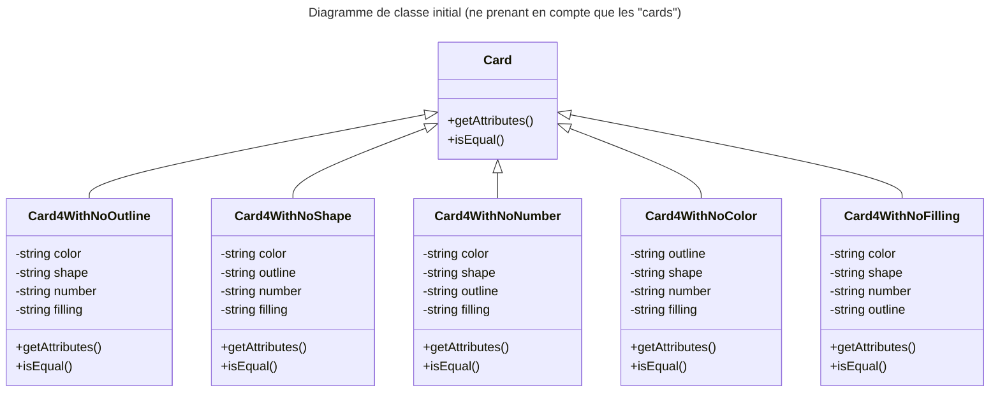

# Class diagram

```mermaid

---
title: Diagramme de classe initial (ne prenant en compte que les "cards")
---

classDiagram
    Card <|-- Card4WithNoOutline
    Card <|-- Card4WithNoShape
    Card <|-- Card4WithNoNumber
    Card <|-- Card4WithNoColor
    Card <|-- Card4WithNoFilling

    
    class Card{
        +getAttributes()
        +isEqual()
    }
    class Card4WithNoOutline{
        -string color
        -string shape
        -string number
        -string filling
        +getAttributes()
        +isEqual()
    }
    class Card4WithNoShape{
        -string color
        -string outline
        -string number
        -string filling
        +getAttributes()
        +isEqual()
    }
    class Card4WithNoColor{
        -string outline
        -string shape
        -string number
        -string filling
        +getAttributes()
        +isEqual()
    }
    class Card4WithNoNumber{
        -string color
        -string shape
        -string outline
        -string filling
        +getAttributes()
        +isEqual()
    }
    class Card4WithNoFilling{
        -string color
        -string shape
        -string number
        -string outline
        +getAttributes()
        +isEqual()
    }

```